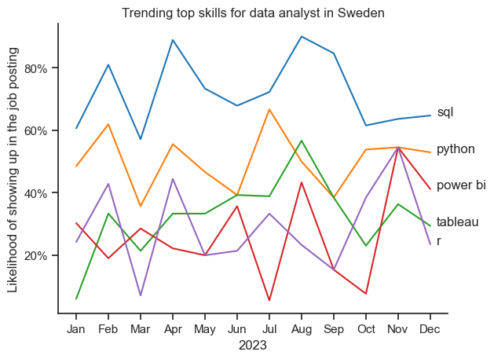

# Overview

Welcome to my analysis of the data job market, focusing on data analyst roles. This project was created out of a desire to navigate and understand the job market more effectively. It delves into the top-paying and in-demand skills to help find optimal job opportunities for data analysts.

The data sourced from [Luke Barousse's Python Course](https://lukebarousse.com/python) which provides a foundation for my analysis, containing detailed information on job titles, salaries, locations, and essential skills. Through a series of Python scripts, I explore key questions such as the most demanded skills, salary trends, and the intersection of demand and salary in data analytics.

# Questions

Below are the questions I want to answer in my project:

1. What are the skills most in demand for the top 3 most popular data roles?
2. How are in-demand skills trending for Data Analysts?

# Tools I used

For my deep dive into the data analyst job market, I harnessed the power of several key tools:

- **Python:** The backbone of my analysis, allowing me to analyze the data and find critical insights.I also used the following Python libraries:
    - **Pandas Library:** This was used to analyze the data. 
    - **Matplotlib Library:** I visualized the data.
    - **Seaborn Library:** Helped me create more advanced visuals. 
- **Jupyter Notebooks:** The tool I used to run my Python scripts which let me easily include my notes and analysis.
- **Visual Studio Code:** My go-to for executing my Python scripts.
- **Git & GitHub:** Essential for version control and sharing my Python code and analysis, ensuring collaboration and project tracking.

# Data preparation and clean-up

This section outlines the steps taken to prepare the data for analysis, ensuring accuracy and usability.

## Import & Clean Up Data

I start by importing necessary libraries and loading the dataset, followed by initial data cleaning tasks to ensure data quality.

```python
# Importing Libraries
import ast
import pandas as pd
import seaborn as sns
from datasets import load_dataset
import matplotlib.pyplot as plt  

# Loading Data
dataset = load_dataset('lukebarousse/data_jobs')
df = dataset['train'].to_pandas()

# Data Cleanup
df['job_posted_date'] = pd.to_datetime(df['job_posted_date'])
df['job_skills'] = df['job_skills'].apply(lambda x: ast.literal_eval(x) if pd.notna(x) else x)
```

## Filter Swedish Jobs

To focus my analysis on the Swedish job market, I apply filters to the dataset, narrowing down to roles based in Sweden.

```python
df_SE = df[df['job_country'] == 'Sweden']

```

# Analysis

## 1. What are the most demanded skills for the top 3 popular data roles?

Dataset was filtered to get the top 5 skills for top 3 roles. This should help with focusing the attention on abilities that are the most sought in different companies in Sweden.

View my notebook with detailed steps here: [2_Skill_demand.ipynb](2_Skill_Demand.ipynb)


### Visualize data
```python
fig, ax = plt.subplots(len(job_titles), 1)
sns.set_theme(style='ticks')

for i, job_title in enumerate(job_titles):
    df_plot = df_skills_perc[df_skills_perc['job_title_short'] == job_title].head(5)
    sns.barplot(data=df_plot, x='skill_perc', y='job_skills', ax=ax[i], hue='skill_count', palette='dark:b_r')
    ax[i].set_title(job_title)
    ax[i].set_ylabel('')
    ax[i].set_xlabel('')
    ax[i].get_legend().remove()
    ax[i].set_xlim(0,70)

    for n, v in enumerate(df_plot['skill_perc']):
        ax[i].text(v + 1, n, f"{v:.0f}%", va='center')

    if i != len(job_titles) - 1:
        ax[i].set_xticks([])

fig.suptitle('Likelihood of required skill in Swedish job postings', fontsize=15)
fig.tight_layout(h_pad=0.5)
plt.show()
```

### Results


### Insights
1. The most important skill to focus on is SQL, requested in more then 50% of all three main data roles
2. Python is the close second - while being even more demanded for Data Engineers and Data Scientists, it showed up in far fewer ads for Data Analysts 
3. Both data scientist and data engineer roles require more specialized technical skills (AWS, Azure), compared to Data Analysts that are expected to be better at more general data management and visualization tools (Power BI, Tableau)


## 2. How are in-demand skills trending for Data Analysts?

```python

df_plot = df_SE_percent.iloc[:, :5]

sns.lineplot(df_plot, dashes=False, palette='tab10')
sns.set_theme(style='ticks')
sns.despine()

plt.title('Trending top skills for data analyst in Sweden')
plt.ylabel('Likelihood of showing up in the job posting')
plt.xlabel('2023')
plt.legend().remove()

from matplotlib.ticker import PercentFormatter
ax = plt.gca()
ax.yaxis.set_major_formatter(PercentFormatter(decimals=0))

for i in range(5):
    plt.text(11.2, df_plot.iloc[-1, i], df_plot.columns[i])

plt.show()

```

### Results


*Bar graph visualizing the trending top skills for data analysts in Sweden in 2023*

## Insights
1. Trends are not steady probably because not large enough sample size
2. SQL and Python consistently stay in the top demand throughout the year
3. Remaining three skills from the top are in demand very interchangeably which suggests they may be equally important for employers

# Lessons learned

Throughout this project, I deepened my understanding of the data analyst job market and enhanced my technical skills in Python, especially in data manipulation and visualization. Here are a few specific things I learned:

- **Advanced Python Usage**: Utilizing libraries such as Pandas for data manipulation, Seaborn and Matplotlib for data visualization, and other libraries helped me perform complex data analysis tasks more efficiently.
- **Data Cleaning Importance**: I learned that thorough data cleaning and preparation are crucial before any analysis can be conducted, ensuring the accuracy of insights derived from the data.
- **Strategic Skill Analysis**: The project emphasized the importance of aligning one's skills with market demand. Understanding the relationship between skill demand, salary, and job availability allows for more strategic career planning in the tech industry.


# Insights

This project provided several general insights into the data job market for analysts:

- **Market Trends**: There are changing trends in skill demand, highlighting the dynamic nature of the data job market. Keeping up with these trends is essential for career growth in data analytics.
- **Value of Skills**: Understanding which skills are in-demand can guide data analysts in prioritizing learning to maximize their employment chances.


# Challenges I Faced

This project was not without its challenges, but it provided good learning opportunities:

- **Data Inconsistencies**: Handling missing or inconsistent data entries requires careful consideration and thorough data-cleaning techniques to ensure the integrity of the analysis.
- **Complex Data Visualization**: Designing effective visual representations of complex datasets was challenging but critical for conveying insights clearly and compellingly.
- **Balancing Breadth and Depth**: Deciding how deeply to dive into each analysis while maintaining a broad overview of the data landscape required constant balancing to ensure comprehensive coverage without getting lost in details.
- **Insufficient data**: The choice to analyze Swedish job market, contrary to U.S. as guided thorugh the course, came up with an unexpected challenge of lacking sufficient data samples. As fine as it was regarding skill demand and trends, the whole part connected to analysing skill economic return and benefits had to be skipped. After the second thought, it could have been smarter to also include remote jobs from the whole EU to investigate these additional parameters.