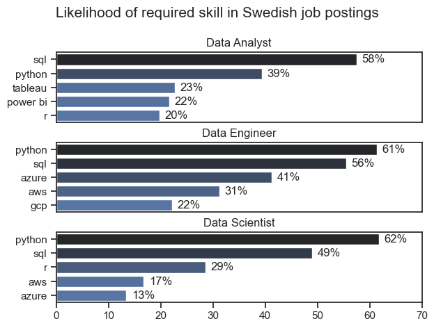

# The Analysis

## 1. What are the most demanded skills for the top 3 popular data roles?

Dataset was filtered to get the top 5 skills for top 3 roles. This should help with focusing the attention on abilities that are the most sought in different companies in Sweden.

View my notebook with detailed steps here: [2_Skill_demand.ipynb](2_Skill_Demand.ipynb)


### Visualize data
```python
fig, ax = plt.subplots(len(job_titles), 1)
sns.set_theme(style='ticks')

for i, job_title in enumerate(job_titles):
    df_plot = df_skills_perc[df_skills_perc['job_title_short'] == job_title].head(5)
    sns.barplot(data=df_plot, x='skill_perc', y='job_skills', ax=ax[i], hue='skill_count', palette='dark:b_r')
    ax[i].set_title(job_title)
    ax[i].set_ylabel('')
    ax[i].set_xlabel('')
    ax[i].get_legend().remove()
    ax[i].set_xlim(0,70)

    for n, v in enumerate(df_plot['skill_perc']):
        ax[i].text(v + 1, n, f"{v:.0f}%", va='center')

    if i != len(job_titles) - 1:
        ax[i].set_xticks([])

fig.suptitle('Likelihood of required skill in Swedish job postings', fontsize=15)
fig.tight_layout(h_pad=0.5)
plt.show()
```

### Results


### Insights
1. The most important skill to focus on is SQL, requested in more then 50% of all three main data roles
2. Python is the close second - while being even more demanded for Data Engineers and Data Scientists, it showed up in far fewer ads for Data Analysts 
3. Both data scientist and data engineer roles require more specialized technical skills (AWS, Azure), compared to Data Analysts that are expected to be better at more general data management and visualization tools (Power BI, Tableau)
